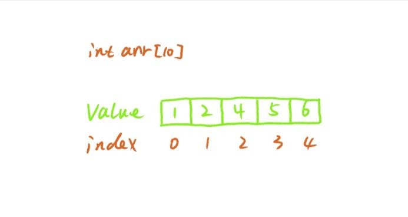
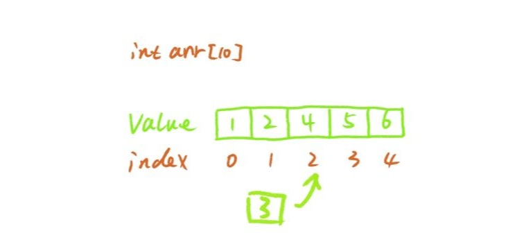
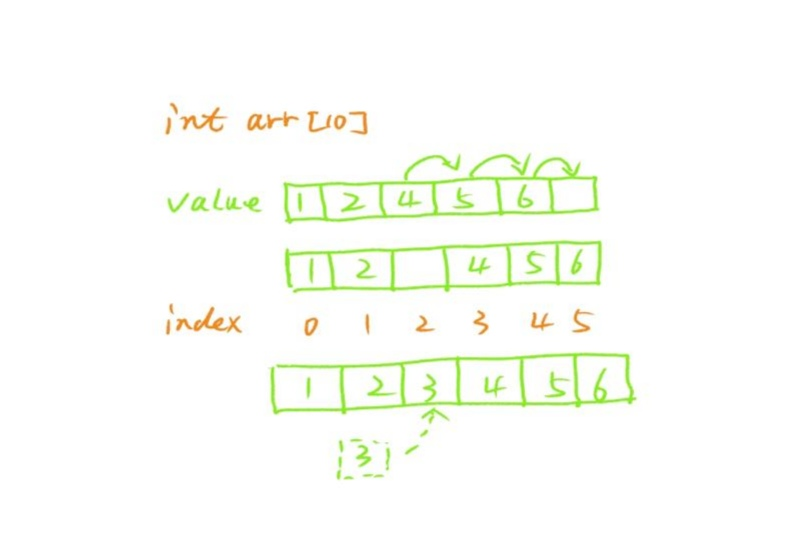
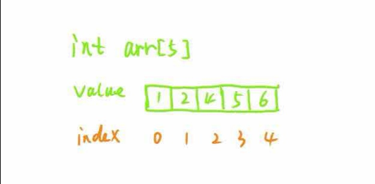
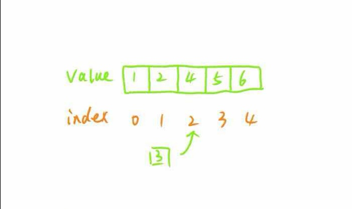
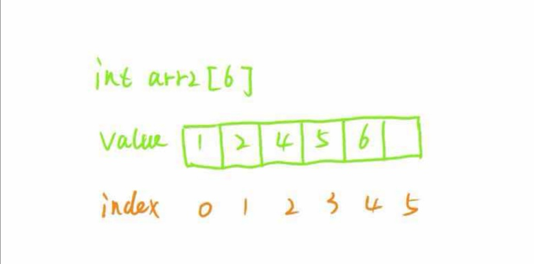
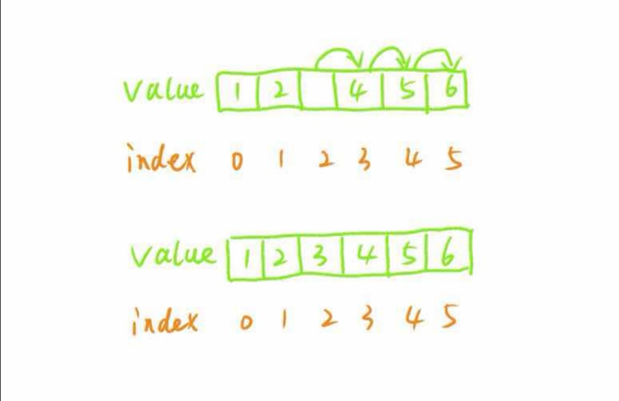

数组

数组是物理上连续的，理解了这句话才算是搞懂了数组。

所谓物理上的连续指的是，在计算机内存上数组里的元素是一个挨着一个顺序放在一起的，而每个元素都是由内存里很多个高低电位表示的（也就是0、1）。可能有人会问，我在使用数组的时候元素长度都是不一样的，计算机是怎么知道下一个元素在哪里呢？

如果有这样的疑问，可能对于计算机的原理理解得不透彻。也可能使用的是“世界上最好的编程语言”PHP。这里并不是对语言有偏见，PHP确实对程序员隐藏了很多系统的底层细节。在系统底层，数组的每个元素长度都是固定的，在下面我们用C语言声明了两个数组：

```
int a[20];
char s[20];
```

数组a表示长度为20每个元素都是一个int型的数组，数组s表示长度为20每个元素都是一个字符（这也是c语言声明字符串的一个方法）的数组。

由于我们预先声明了数组a和数组s中元素的数据类型，所以每个元素大小我们是知道的，对于64位机器来讲，一个int就占用64位，但对于像go这类语言在语言层面做了优化，int实际只占用了32位空间。同样的，对于数组s，每个元素都是一个字符，以UTF8为例，一个字符占用4个字节，也就是32位空间。

这样，由于事先知道每个元素的大小，我们只需要知道数组第一个元素的起始地址，就能推导出其它元素所在的位置了，如果理解了以上原理，对于c语言中“数组变量和指针有什么区别”这个问题相信也有了答案了，由于每个元素的位置是固定的。所以，数组的访问是非常高效的。

这也是为什么学习编程推荐学习java、c/c++这类静态语言，因为这类语言在使用时能更接近系统底层，从而能让你更深刻的理解系统原理。

上面提到数组在物理上是连续的，我们通过数组元素的类型就可以推断出元素占用的大小，从而能高效的计算出每个元素所在的固定位置 ，访问数组元素只需要一次搜索就可以访问到。所以，数组的访问时间复杂度为O(1)。

在实际场景中我们使用数组不光是访问数据，还要根据需要往数组里面插入元素，那么对于插入元素，数组是怎么处理的呢？

数组的插入我们可以大致上分两种情况来看，第一种情况就是在数组尾部插入元素，这时候，只要我们的数组空间够用，追加到数组末尾就可以了（这里我们先不考虑数组空间不够的情况）。第二种情况，假设我们要在数组中间位置插入元素应该怎么处理呢？很遗憾，在实际编程场景中，大部分可能都是这种场景。假如我们现在有一个数组，如图（1）：

                                                图（1）

我们要在下标为2的地方插入一个元素3（不考虑数组空间不够的情况）。首先，我们需要将4以及4后面的元素向移动一个位置，如图（1）：

                                                图（2）

然后我们需要将原来4的位置赋值成3，如下：

                                                图（3）

在这个过程中，数组搬移了3个元素进了行3次移动 ，可能你已经看出来了，最坏的情况是我们要在数组起始位置插入一个元素，这个时候我们需要搬移的元素个数就是数组的长度，这里的长度是已经幅值的元素的个数，假设长度为n。那么，在最坏的情况下，插入一个元素的时间复杂度为O(n)。

接下来我们来看如果数组空间不够应该怎么办，假如数组的长度是5，如下：

                                                图（4）

这时候我们如果想向数组里插入一个元素会发生什么呢？比如我们向索引2的位置插入元素3，如图（5）

                                                图（5）

答案是插入不了的，数组已经满了，对于PHP、python这类动态类型的语言，从语言引擎层做了封装，所以，在使用的时是候感受不到的，但是对于c/c++和java这类静态语言来说，数组的大小是声明的时候指定的，后期是无法动态改变的。当然，java也实现了动态数组arraylist，但其原生的数组是不支持动态扩容的。

那怎么办呢 ，答案是再创建一个更大的数组，一个直接的做法就是插入几个元素就增加几个容量。比如，原来的数组长度是5，要往里面增加一个元素，那我们就再创建一个长度为6的数组不就可以容纳下新元素了吗？顺着这个思路，我们来看一下如何进行数组的扩容。

假设我们还是下标为2的地方插入一个元素，这个时候由于原数组的容量只有5，所以我们必须新创建一个数组，我们把新数组的长度设置为6，如下：

                                                图（6）

然后我们将原数组搬移到新的数组里面，这时候arr2的容量就是6，还可以容纳一个元素，然后按照前面插入元素的方法将3插入到下标为2的位置，变成下面这样：

                                                图（7）

上面的方式有一个比较严重的问题，如果我们的程序需要频繁的往数组插入元素，就会导致频繁的数组创建和搬移，这个效率是很低的，一个更好的方法就是在每次数组空间达到极限的时候创建一个大很多的数组。比如，上面的例子中，如果插入元素的时候发现数组空间已经满了，我们可以预先创建一个比原数组空间大两倍的数组，如下：

 
```
int arr2[10];
```

但是，这又带来了另一个问题。当这个数组比较大的时候，比如当前数组的长度是10000，下一次扩容就会创建一个20000长度的数组，这时候除非你能很确定接下来有10000个元素会被插入进来，但大概率是扩容的10000个长度大部分可能是用不到的，这就造成了空间浪费。一个最佳实践是在比较小的时候比如一开始数组长度只有个位数，我们可以成倍的扩容，但随着数组长度越来越大，我们可以设置一个比例，并且这个比例随着数组长度越来越大，会越来越小。我们把数组的长度用L来表示。例如，当L==5的时候，扩容L * 100% ，当L==100的时候扩容L * 20% ，当L==1000的时候扩容L*10% 当L==10000的时候扩容L * 5%等等，当然，设置比例有很多种方法，这里只提供了一种思路。

那么，数组插入的时间复杂度是多少呢？最好的情况，插入到末尾时间复杂度为O(1)，最坏的情况，插入到数组开头，需要进行n次搬移，时间复杂度为O(n)，其中n是数组的长度。由于我们插入元素很多时候都是插入到数组中间的，会触发搬移动作，并且在数组容量不够的情况下，还需要对数组进行扩容，一般我们认为数组插入元素的时间复杂度为：O(n)

可能你会觉得，这也太麻烦了，平时在写代码的时候也没有这么复杂啊。但是，没办法，数组的操作就是这么麻烦，平时没有去考虑是因为语言都封闭好了，java有arraylist，python有list，go有slice，php有array、c++也有自己的container库，这些特性的底层无一例外都使用了我们上面讲到的思想。所以，哪有什么岁月静好，只不过有大神做了封装而已。

总结一下    
1.数组在物理上是连续、顺序存储的    
2.数组访问和插入的时间复杂度分别为：O(1)和O(N)    
3.数组的插入会触发数据的搬移和扩容    
4.数组的扩容一个最佳实践是当容量大的时候给一个比较小的比例，不能过大，也不能太小。   

下面来看几个实例

一、实现一个动态数组：

java版本：https://github.com/seepre/data-structure/blob/java/Array/src/Array.java

go版本：https://github.com/seepre/data-structure/blob/java/Array/src/Array.java

二、使用数组实现一个堆：（什么是堆，后面会有专门文章来说明）

https://github.com/seepre/data-structure/blob/java/Heap/src/MaxHeap.java
